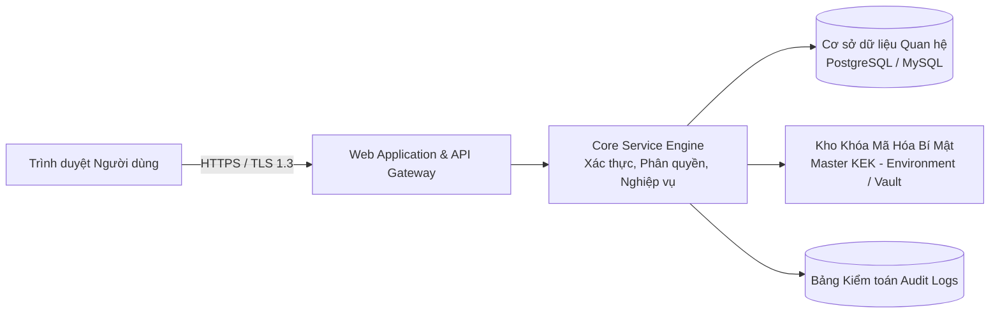
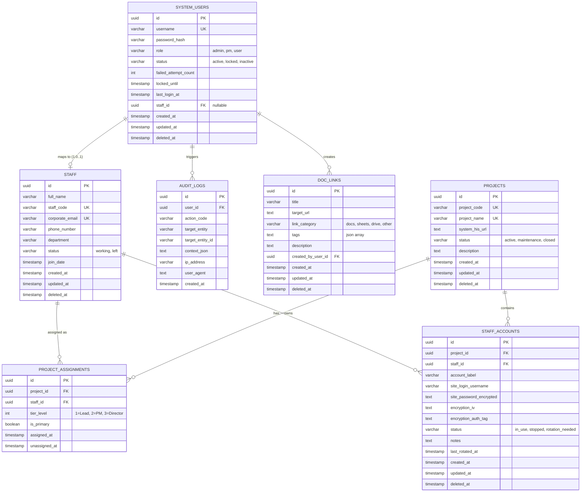
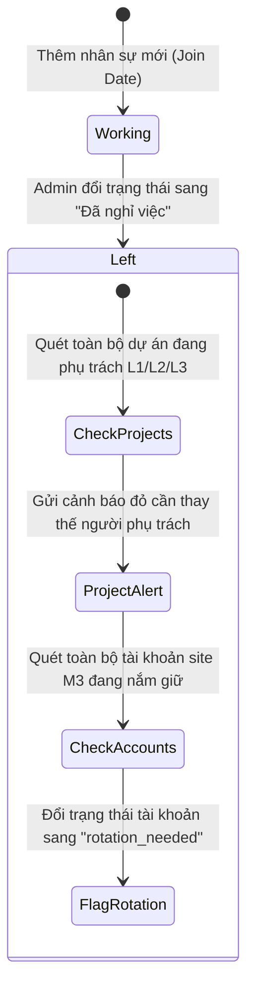

mys

# TÀI LIỆU ĐẶC TẢ YÊU CẦU PHẦN MỀM & THIẾT KẾ NGHIỆP VỤ (SRS & TECHNICAL SPECIFICATION)

**Tên dự án:** Nền tảng Quản trị Tập trung Tài sản Số, Tài nguyên Nhân sự & Thông tin Xác thực Dự án (Internal Operations & Credential Management Hub - OCMH)
**Mã dự án:** PMS-OCMH
**Phiên bản:** 2.1 (Bản chuẩn hóa 100% sau khi thống nhất toàn bộ yêu cầu với Product Owner)
**Ngày cập nhật:** 05/10/2026
**Trạng thái:** Đã phê duyệt yêu cầu (Requirements Approved - Ready for Coding)

---

## LỊCH SỬ THAY ĐỔI TÀI LIỆU (DOCUMENT REVISION HISTORY)

| Phiên bản   | Ngày                | Tác giả               | Nội dung thay đổi                                                                                                                                                                                                                                                                                                                                                                                                                                                                                                         |
| ------------- | -------------------- | ----------------------- | ---------------------------------------------------------------------------------------------------------------------------------------------------------------------------------------------------------------------------------------------------------------------------------------------------------------------------------------------------------------------------------------------------------------------------------------------------------------------------------------------------------------------------- |
| 0.1           | 05/10/2026           | BA Team                 | Phác thảo yêu cầu cơ bản sơ khởi                                                                                                                                                                                                                                                                                                                                                                                                                                                                                     |
| 0.2           | 05/10/2026           | BA Team                 | Bổ sung Use case, ERD sơ bộ, API list, Test case cơ bản                                                                                                                                                                                                                                                                                                                                                                                                                                                                 |
| 2.0           | 05/10/2026           | Lead BA                 | Chuẩn hóa toàn diện, mã hóa AES-256-GCM, ISO/IEC 25010                                                                                                                                                                                                                                                                                                                                                                                                                                                                 |
| 2.1           | 05/10/2026           | Lead BA                 | Chốt 100% quyết định nghiệp vụ và công nghệ Fullstack Next.js                                                                                                                                                                                                                                                                                                                                                                                                                                                       |
| **2.2** | **05/10/2026** | **Lead BA / Dev** | **Bổ sung tính năng Import Excel hàng loạt:**1. Kho Link Docs/Sheets (`POST /api/doc-links/import`).2. Danh mục Nhân sự (`POST /api/staff/import`).3. Két Mật khẩu Site (`POST /api/vault/accounts/import`) kèm tự động mã hóa AES-256-GCM.4. Component `ExcelImportModal` hỗ trợ tải file mẫu `.xlsx`, xem trước bảng dữ liệu và kiểm tra lỗi thời gian thực.                                                                                                                |
| **2.3** | **05/10/2026** | **Lead BA / Dev** | **Mở rộng Import Excel toàn diện cho Quản lý Dự án & Quản trị Người dùng:**1. Dự án (`POST /api/projects/import`): Hỗ trợ import dự án kèm tự động giải quyết phân công nhân sự L1/L2/L3.2. Người dùng Tool (`POST /api/users/import`): Hỗ trợ import tài khoản, tự sinh mật khẩu bảo mật và liên kết hồ sơ nhân sự.3. Tối ưu bộ parser `ExcelImportModal`: Tự động loại bỏ dòng rỗng, chuẩn hóa ánh xạ cột không phân biệt chữ hoa thường. |

---

## MỤC LỤC HỆ THỐNG

1. [Giới thiệu & Mục tiêu Dự án](#1-giới-thiệu--mục-tiêu-dự-án)
2. [Kiến trúc Tổng thể & Phân quyền (RBAC)](#2-kiến-trúc-tổng-thể--phân-quyền-rbac)
3. [Mô hình Dữ liệu Chi tiết (Database Schema & ERD)](#3-mô-hình-dữ-liệu-chi-tiết-database-schema--erd)
4. [Đặc tả Phân hệ & Yêu cầu Chức năng (Functional Specs)](#4-đặc-tả-phân-hệ--yêu-cầu-chức-năng-functional-specs)
   - Phân hệ AUTH & M1: Quản trị Định danh & Người dùng Tool
   - Phân hệ M5: Quản trị Dữ liệu gốc Nhân sự (Staff Master Data)
   - Phân hệ M2: Quản trị Tài liệu số (Docs/Sheets Asset Hub)
   - Phân hệ M4: Quản lý Dự án & Cấp độ Phụ trách (Project Matrix L1/L2/L3)
   - Phân hệ M3: Két mã hóa Thông tin Xác thực Site (Credential Vault)
   - Phân hệ LOG: Nhật ký Kiểm toán Bất biến (Security Audit Trail)
5. [Quy tắc Nghiệp vụ Hệ thống (Business Rules - BR)](#5-quy-tắc-nghiệp-vụ-hệ-thống-business-rules---br)
6. [Quy tắc Kiểm tra Dữ liệu (Validation Rules)](#6-quy-tắc-kiểm-tra-dữ-liệu-validation-rules)
7. [Đặc tả Giao diện Lập trình (RESTful API Specification)](#7-đặc-tả-giao-diện-lập-trình-restful-api-specification)
8. [Danh mục Mã lỗi & Thông báo Hệ thống (Messages Dictionary)](#8-danh-mục-mã-lỗi--thông-báo-hệ-thống-messages-dictionary)
9. [Yêu cầu Phi Chức năng (NFR theo chuẩn ISO/IEC 25010)](#9-yêu-cầu-phi-chức-năng-nfr-theo-chuẩn-isoiec-25010)
10. [Ma trận Kiểm thử & Ca kiểm thử Trọng yếu (Test Cases)](#10-ma-trận-kiểm-thử--ca-kiểm-thử-trọng-yếu-test-cases)
11. [Khuyến nghị Công nghệ & Lộ trình Triển khai](#11-khuyến-nghị-công-nghệ--lộ-trình-triển-khai)

---

## 1. GIỚI THIỆU & MỤC TIÊU DỰ ÁN

### 1.1 Bối cảnh & Bài toán cần giải quyết

Hiện nay trong quá trình vận hành, thông tin tài liệu (Google Docs, Sheets), thông tin tài khoản truy cập site/hệ thống khách hàng, và thông tin liên hệ phân cấp của dự án bị phân tán rời rạc qua file Excel, tin nhắn chat cá nhân. Tình trạng này dẫn đến:

- Rủi ro an ninh thông tin cực cao (lộ mật khẩu khách hàng).
- Mất mát tài sản số khi nhân sự nghỉ việc đột ngột.
- Chậm trễ trong phản ứng sự cố do không rõ đầu mối Level 1, 2, 3 phụ trách.

### 1.2 Mục tiêu Hệ thống

Xây dựng một nền tảng tập trung (Single Source of Truth) vận hành nội bộ, đáp ứng tiêu chuẩn an toàn thông tin doanh nghiệp, hỗ trợ:

1. Quản lý phân quyền tài khoản truy cập tool.
2. Quản lý kho link Google Docs/Sheets thông minh (tự nhận diện định dạng, kiểm tra trùng lặp).
3. Quản lý danh mục nhân sự và gắn kết với dự án.
4. Quản lý link dự án (Link hệ thống vận hành / HIS) và mô hình phân cấp chịu trách nhiệm L1/L2/L3.
5. Két bảo mật lưu trữ thông tin xác thực site dự án (Credential Vault) được mã hóa AES-256-GCM kèm cơ chế Re-Authentication và tự động che giấu mật khẩu.
6. Hệ thống Audit Trail bất biến ghi vết 100% các hành vi nhạy cảm.

---

## 2. KIẾN TRÚC TỔNG THỂ & PHÂN QUYỀN (RBAC)

### 2.1 Sơ đồ Khái niệm Kiến trúc



### 2.2 Định nghĩa Vai trò (User Roles)

- **Super Admin (`admin`):** Quản trị hệ sinh thái, cấu hình người dùng tool, danh mục nhân sự, dự án, xem và quản trị toàn bộ tài khoản site, xem nhật ký kiểm toán.
- **Project Manager (`pm`):** Quản lý dự án mình phụ trách, xem nhân sự, thêm/sửa tài khoản thuộc dự án mình, quản lý link tài liệu.
- **Standard User (`user`):** Thành viên dự án. Xem link Docs/Sheets, xem các dự án mình tham gia; **được xem và mở mật khẩu của tất cả các tài khoản site thuộc dự án mà mình tham gia** (yêu cầu xác thực lại Re-Authentication và luôn bị ghi Audit Log).

### 2.3 Ma trận Phân quyền Chức năng & Dữ liệu chi tiết

| Nhóm chức năng                 | Hành động cụ thể                                      |    Super Admin    |           Project Manager           |                Standard User                |
| --------------------------------- | ---------------------------------------------------------- | :---------------: | :---------------------------------: | :------------------------------------------: |
| **Xác thực**              | Đăng nhập, Đăng xuất, Đổi mật khẩu của mình    |        ✔        |                 ✔                 |                      ✔                      |
| **M1: Người dùng Tool**  | Xem danh sách người dùng                               |        ✔        |                 ✘                 |                      ✘                      |
|                                   | Thêm / Sửa / Xóa người dùng                          |        ✔        |                 ✘                 |                      ✘                      |
|                                   | Mở khóa / Đặt lại mật khẩu người dùng khác      |        ✔        |                 ✘                 |                      ✘                      |
| **M5: Danh mục Nhân sự** | Xem danh mục nhân sự                                    |        ✔        |                 ✔                 |                      ✔                      |
|                                   | Thêm / Sửa / Đổi trạng thái nhân sự                |        ✔        |                 ✘                 |                      ✘                      |
|                                   | Xóa mềm nhân sự (phải gỡ hết liên kết)            |        ✔        |                 ✘                 |                      ✘                      |
| **M2: Link Docs/Sheets**    | Xem danh sách link                                        |        ✔        |                 ✔                 |                      ✔                      |
|                                   | Thêm link mới                                            |        ✔        |                 ✔                 |                      ✔                      |
|                                   | Sửa / Xóa link của mình tạo                           |        ✔        |                 ✔                 |                      ✔                      |
|                                   | Sửa / Xóa link của người khác tạo                   |        ✔        |                 ✔                 |                      ✘                      |
| **M4: Quản lý Dự án**   | Xem danh sách dự án                                     |        ✔        |                 ✔                 |            ✔ (dự án tham gia)            |
|                                   | Thêm dự án mới                                         |        ✔        |                 ✔                 |                      ✘                      |
|                                   | Sửa thông tin dự án                                    |        ✔        |         ✔ (nếu là L1/L2)         |                      ✘                      |
|                                   | Xóa mềm dự án                                          |        ✔        |                 ✘                 |                      ✘                      |
| **M3: Tài khoản Site**    | Xem danh sách tài khoản (chế độ ẩn`••••••`) |     Toàn bộ     |        Thuộc dự án mình        |        Thuộc dự án mình tham gia        |
|                                   | **Hiển thị mật khẩu rõ (Reveal Password)**      | ✔ (Cần Re-Auth) | ✔ (Thuộc dự án mình + Re-Auth) | ✔ (Thuộc dự án mình tham gia + Re-Auth) |
|                                   | Thêm / Sửa tài khoản                                   |        ✔        |         ✔ (thuộc dự án)         |                      ✘                      |
|                                   | Xóa tài khoản                                           |        ✔        |                 ✘                 |                      ✘                      |
| **LOG: Kiểm toán**        | Xem nhật ký Audit Logs & Xuất báo cáo                 |        ✔        |                 ✘                 |                      ✘                      |

---

## 3. MÔ HÌNH DỮ LIỆU CHI TIẾT (DATABASE SCHEMA & ERD)

### 3.1 Sơ đồ Thực thể Liên kết (Entity Relationship Diagram)



### 3.2 Đặc tả Chi tiết các Bảng Dữ liệu

#### 1. Bảng `system_users` (Người dùng Đăng nhập Tool)

- `id` (UUID, Primary Key, Default `gen_random_uuid()`)
- `username` (VARCHAR(50), Unique, Not Null): Tên đăng nhập chữ thường.
- `password_hash` (VARCHAR(255), Not Null): Chuỗi băm Argon2id / bcrypt.
- `role` (VARCHAR(20), Not Null, Default `'user'`): Giá trị `admin`, `pm`, `user`.
- `status` (VARCHAR(20), Not Null, Default `'active'`): Giá trị `active`, `locked`, `inactive`.
- `failed_attempt_count` (INT, Default 0): Bộ đếm số lần đăng nhập sai liên tiếp.
- `locked_until` (TIMESTAMP WITH TIME ZONE, Nullable): Thời hạn mở khóa khi bị tạm khóa.
- `last_login_at` (TIMESTAMP WITH TIME ZONE, Nullable): Thời điểm đăng nhập gần nhất.
- `must_change_password` (BOOLEAN, Default FALSE): Bắt buộc đổi mật khẩu lần đầu.
- `staff_id` (UUID, Foreign Key tham chiếu `staff.id`, Nullable): Cho phép ánh xạ User với Nhân sự thực tế để kích hoạt Row-Level Security.
- `created_at`, `updated_at`, `deleted_at` (TIMESTAMP WITH TIME ZONE).

#### 2. Bảng `staff` (Danh mục Nhân sự)

- `id` (UUID, Primary Key)
- `full_name` (VARCHAR(100), Not Null): Họ và tên nhân sự.
- `staff_code` (VARCHAR(30), Unique, Nullable): Mã số nhân viên (ví dụ: `EMP001`).
- `corporate_email` (VARCHAR(150), Unique, Nullable): Email công ty.
- `phone_number` (VARCHAR(20), Nullable): Số điện thoại liên hệ.
- `department` (VARCHAR(100), Nullable): Phòng ban / Bộ phận.
- `status` (VARCHAR(20), Not Null, Default `'working'`): `working` (Đang làm), `left` (Đã nghỉ việc).
- `join_date` (DATE, Nullable): Ngày vào làm.
- `created_at`, `updated_at`, `deleted_at` (TIMESTAMP WITH TIME ZONE).

#### 3. Bảng `doc_links` (Kho Link Tài liệu)

- `id` (UUID, Primary Key)
- `title` (VARCHAR(200), Not Null): Tên gợi nhớ của tài liệu.
- `target_url` (TEXT, Not Null): Đường dẫn URL đầy đủ.
- `link_category` (VARCHAR(20), Not Null, Default `'other'`): `docs`, `sheets`, `drive`, `other`. Tự động trích xuất theo regex.
- `tags` (JSONB, Default `'[]'`): Mảng các nhãn (ví dụ: `["Kế hoạch", "Báo cáo", "Quy trình"]`).
- `description` (TEXT, Nullable): Ghi chú mô tả chi tiết.
- `created_by_user_id` (UUID, Foreign Key tham chiếu `system_users.id`, Not Null).
- `created_at`, `updated_at`, `deleted_at` (TIMESTAMP WITH TIME ZONE).

#### 4. Bảng `projects` (Danh mục Dự án)

- `id` (UUID, Primary Key)
- `project_code` (VARCHAR(50), Unique, Nullable): Mã dự án nội bộ (ví dụ: `PRJ-MED-01`).
- `project_name` (VARCHAR(150), Unique, Not Null): Tên đầy đủ của dự án.
- `system_his_url` (TEXT, Not Null): Link hệ thống vận hành / HIS / Portal live của dự án.
- `status` (VARCHAR(20), Not Null, Default `'active'`): `active` (Đang chạy), `maintenance` (Bảo trì), `closed` (Kết thúc).
- `description` (TEXT, Nullable): Tóm tắt nghiệp vụ dự án.
- `created_at`, `updated_at`, `deleted_at` (TIMESTAMP WITH TIME ZONE).

#### 5. Bảng `project_assignments` (Phân công Cấp độ Phụ trách Dự án)

- `id` (UUID, Primary Key)
- `project_id` (UUID, Foreign Key tham chiếu `projects.id`, Not Null)
- `staff_id` (UUID, Foreign Key tham chiếu `staff.id`, Not Null)
- `tier_level` (SMALLINT, Not Null):
  - `1`: Level 1 - Kỹ thuật / Đầu mối vận hành trực tiếp (Direct In-charge / Tech Lead).
  - `2`: Level 2 - Quản lý Dự án (Project Manager / Scrum Master).
  - `3`: Level 3 - Giám đốc Bảo trợ / Lãnh đạo cấp cao (Account Sponsor / Delivery Director).
- `is_primary` (BOOLEAN, Default TRUE): Đánh dấu người phụ trách chính của cấp đó.
- `assigned_at` (TIMESTAMP WITH TIME ZONE, Default NOW())
- `unassigned_at` (TIMESTAMP WITH TIME ZONE, Nullable)
- *Ràng buộc:* `UNIQUE (project_id, tier_level, staff_id)` trên các bản ghi đang hiệu lực.

#### 6. Bảng `staff_accounts` (Két Thông tin Xác thực Site Dự án)

- `id` (UUID, Primary Key)
- `project_id` (UUID, Foreign Key tham chiếu `projects.id`, Not Null)
- `staff_id` (UUID, Foreign Key tham chiếu `staff.id`, Not Null)
- `account_label` (VARCHAR(100), Not Null): Tên gợi nhớ của tài khoản (ví dụ: `Admin Portal Khách hàng`, `Tài khoản Root Server Staging`).
- `site_login_username` (VARCHAR(150), Not Null): Tên đăng nhập trên site dự án.
- `site_password_encrypted` (TEXT, Not Null): Chuỗi mật khẩu đã mã hóa bằng thuật toán AES-256-GCM.
- `encryption_iv` (TEXT, Not Null): Initialization Vector ngẫu nhiên (12 bytes base64) cho mỗi bản ghi.
- `encryption_auth_tag` (TEXT, Not Null): Authentication Tag xác thực tính toàn vẹn (16 bytes base64).
- `status` (VARCHAR(20), Not Null, Default `'in_use'`): `in_use` (Đang dùng), `stopped` (Đã ngừng), `rotation_needed` (Cần đổi pass).
- `notes` (TEXT, Nullable): Ghi chú hướng dẫn sử dụng tài khoản.
- `last_rotated_at` (TIMESTAMP WITH TIME ZONE, Nullable): Ngày đổi mật khẩu site gần nhất.
- `created_at`, `updated_at`, `deleted_at` (TIMESTAMP WITH TIME ZONE).
- *Ràng buộc:* `UNIQUE (project_id, staff_id, site_login_username)` trên bản ghi chưa xóa.

#### 7. Bảng `audit_logs` (Nhật ký Kiểm toán Bất biến)

- `id` (UUID, Primary Key)
- `user_id` (UUID, Foreign Key tham chiếu `system_users.id`, Nullable nếu đăng nhập sai)
- `action_code` (VARCHAR(50), Not Null): Mã hành vi (ví dụ: `VAULT_REVEAL_PASSWORD`, `AUTH_LOGIN_FAILED`).
- `target_entity` (VARCHAR(50), Not Null): Bảng bị tác động (`staff_accounts`, `projects`, `users`).
- `target_entity_id` (VARCHAR(100), Nullable): Khóa chính của bản ghi bị tác động.
- `context_json` (JSONB, Nullable): Chi tiết bổ sung (giá trị cũ/mới, không bao gồm plaintext password).
- `ip_address` (VARCHAR(45), Not Null): Địa chỉ IP client gọi request.
- `user_agent` (TEXT, Nullable): Trình duyệt / Thiết bị gọi API.
- `created_at` (TIMESTAMP WITH TIME ZONE, Default NOW(), Immutable - Không được sửa/xóa).

---

## 4. ĐẶC TẢ PHÂN HỆ & YÊU CẦU CHỨC NĂNG (FUNCTIONAL SPECS)

### PHÂN HỆ AUTH & M1: XÁC THỰC & NGƯỜI DÙNG TOOL

#### UC-01: Đăng nhập Hệ thống (Authentication)

- **Tác nhân:** Toàn bộ người dùng.
- **Tiền điều kiện:** Tài khoản đã được tạo và ở trạng thái `active`.
- **Luồng xử lý chính:**
  1. Người dùng nhập `username` và `password`.
  2. Hệ thống chuẩn hóa `username = username.trim().toLowerCase()`.
  3. Kiểm tra xem tài khoản có đang bị khóa (`locked_until > NOW()`) $\rightarrow$ Nếu có, trả lời lỗi `MSG-03`.
  4. So khớp `password` với `password_hash` bằng Argon2id/bcrypt.
  5. Nếu khớp: Reset `failed_attempt_count = 0`, `locked_until = NULL`. Cập nhật `last_login_at = NOW()`.
  6. Khởi tạo phiên đăng nhập (JWT access token 15 phút kèm HttpOnly Refresh Token 8 tiếng).
  7. Ghi Audit Log: `AUTH_LOGIN_SUCCESS`. Chuyển hướng vào Dashboard.
- **Xử lý ngoại lệ Brute-force:**
  - Nếu sai mật khẩu: Tăng `failed_attempt_count += 1`. Ghi log `AUTH_LOGIN_FAILED`.
  - Nếu `failed_attempt_count >= 5`: Thiết lập `locked_until = NOW() + INTERVAL '15 MINUTES'`. Trả về `MSG-03`.

#### UC-03: Đổi Mật khẩu Cá nhân (Change Password)

- Người dùng bắt buộc nhập mật khẩu cũ, mật khẩu mới, xác nhận mật khẩu mới.
- Mật khẩu mới phải đạt chuẩn BR-04 và không được trùng mật khẩu cũ.
- Khi đổi mật khẩu thành công: Hủy toàn bộ các phiên làm việc (Revoke Refresh Tokens) trên các thiết bị khác, ngoại trừ phiên hiện tại.

#### UC-06: Quản lý Người dùng Tool (M1 - Admin only)

- Admin tạo tài khoản cho nhân sự mới, gán Role (`admin`, `pm`, `user`).
- Cho phép liên kết tài khoản này với 1 bản ghi trong danh mục `staff`.
- **Quy tắc bất biến:** Không bao giờ cho phép Admin khóa hoặc xóa chính mình; hệ thống luôn phải có ít nhất 1 tài khoản Admin ở trạng thái `active`.

---

### PHÂN HỆ M5: DANH MỤC NHÂN SỰ (STAFF MASTER DATA)

#### Vòng đời Nhân sự & Kích hoạt Quy trình Thu hồi Quyền (Offboarding Lifecycle)

Khi một nhân sự chuyển trạng thái từ `working` sang `left`:



- **Ràng buộc xóa:** Tuyệt đối không cho phép xóa vật lý (Hard Delete) hồ sơ nhân sự nếu nhân sự đó đã từng phát sinh dữ liệu liên kết trong `project_assignments` hoặc `staff_accounts`.

---

### PHÂN HỆ M2: KHO TÀI LIỆU SỐ (DOCS/SHEETS ASSET HUB)

#### Cơ chế Nhận diện Thông minh & Bóc tách File ID (Smart URL Parsing)

Khi người dùng dán đường dẫn vào ô URL:

- Regex kiểm tra `docs.google.com/document/d/([a-zA-Z0-9_-]+)` $\rightarrow$ Gán category `docs`, bóc tách `google_file_id`.
- Regex kiểm tra `docs.google.com/spreadsheets/d/([a-zA-Z0-9_-]+)` $\rightarrow$ Gán category `sheets`, bóc tách `google_file_id`.
- Regex kiểm tra `drive.google.com/drive/folders/([a-zA-Z0-9_-]+)` $\rightarrow$ Gán category `drive`.
- Nếu `google_file_id` đã tồn tại trong CSDL: Hệ thống bật cảnh báo mềm `MSG-31`: *"File Google này đã được lưu trước đó với tên '{tên_cũ}'. Bạn có chắc chắn muốn lưu thêm bản ghi này không?"*

---

### PHÂN HỆ M4: QUẢN LÝ DỰ ÁN & MA TRẬN PHỤ TRÁCH (PROJECT MATRIX)

#### Đặc tả Phân cấp Trách nhiệm (Tier Escalation Matrix)

- **Tên dự án:** Duy nhất trên toàn hệ thống (không phân biệt hoa/thường).
- **Link HIS:** Đường dẫn URL trực tiếp tới portal vận hành / HIS của dự án.
- **Ràng buộc phân bổ nhân sự:**
  - **Level 1 (Bắt buộc):** Phải chọn 1 nhân sự đang làm việc (`status = 'working'`).
  - **Level 2 (Tùy chọn):** Quản lý dự án. Không được trùng với nhân sự Level 1.
  - **Level 3 (Tùy chọn):** Lãnh đạo phụ trách tài khoản. Không được trùng với Level 1 và Level 2.
- **Luồng bàn giao dự án (Handover):** Khi sửa đổi người phụ trách Level 1 hoặc Level 2, hệ thống không tự động xóa tài khoản site của nhân sự cũ mà gửi thông báo hướng dẫn Admin thực hiện bàn giao credential an toàn.

---

### PHÂN HỆ M3: KÉT MÃ HÓA THÔNG TIN XÁC THỰC SITE (CREDENTIAL VAULT)

#### Quy trình Bước xác thực Thứ hai (Step-Up Re-Authentication Flow)

Mật khẩu site dự án là tài sản tối mật. Để hiển thị mật khẩu rõ:

1. Giao diện hiển thị mặc định: `••••••••••••`.
2. Người dùng nhấn nút biểu tượng con mắt "Hiển thị Mật khẩu".
3. Một Modal yêu cầu: *"Để bảo mật, vui lòng nhập lại mật khẩu đăng nhập Tool của bạn"*.
4. Client gửi API `POST /api/v1/vault/accounts/{id}/reveal` kèm `{ current_password: "..." }`.
5. Backend kiểm tra:
   - Nếu User có Role `admin`: Được phép mở xem mật khẩu mọi tài khoản.
   - Nếu User có Role `user` hoặc `pm`: Được phép mở xem mật khẩu nếu tài khoản site đó thuộc dự án mà User tham gia (User đang là nhân sự phụ trách L1/L2/L3 hoặc có hồ sơ nhân sự được gán trong dự án đó). Người dùng ngoài dự án sẽ bị từ chối `MSG-06`.
   - Xác thực `current_password` (mật khẩu tài khoản Tool) chính xác.
6. Backend giải mã AES-256-GCM từ ciphertext + IV + Tag và Master Key từ bộ nhớ RAM.
7. Ghi Audit Log hành vi: `VAULT_REVEAL_PASSWORD` kèm thông tin User, Account, Project và IP.
8. Backend trả về plaintext password.
9. **Cơ chế tại Client:**
   - Bật đồng hồ đếm ngược 15 giây.
   - Cho phép bấm nút "Copy". Sau khi copy, gửi lệnh Clear Clipboard sau 30 giây.
   - Khi hết 15 giây hoặc khi người dùng chuyển sang tab trình duyệt khác (`visibilitychange` event): Tự động xóa chuỗi mật khẩu khỏi DOM, reset về `••••••••••••`.

---

## 5. QUY TẮC NGHIỆP VỤ HỆ THỐNG (BUSINESS RULES - BR)

| Mã BR          | Tên quy tắc                          | Nội dung chi tiết                                                                                                                                                                                 |
| --------------- | -------------------------------------- | --------------------------------------------------------------------------------------------------------------------------------------------------------------------------------------------------- |
| **BR-01** | Chuẩn hóa Tên đăng nhập          | `username` không phân biệt hoa thường khi đăng nhập, lưu trữ dạng chữ thường, chỉ chứa `a-z, 0-9, ., _, -`, độ dài từ 4-30 ký tự.                                         |
| **BR-02** | Khóa Brute-force Tự động           | Nhập sai mật khẩu liên tiếp 5 lần$\rightarrow$ Khóa tài khoản tạm thời 15 phút. Mỗi lần sai tiếp theo cộng dồn 15 phút. Admin có quyền mở khóa cưỡng chế ngay lập tức. |
| **BR-03** | Quản lý Thời hạn Phiên            | Hết hạn nhàn rỗi (Idle Timeout) sau 15 phút không gửi request. Hết hạn tuyệt đối (Absolute Session Expiry) sau 8 tiếng.                                                                |
| **BR-04** | Chính sách Độ mạnh Mật khẩu     | Mật khẩu tài khoản Tool tối thiểu 8 ký tự, tối đa 64 ký tự; bao gồm ít nhất 1 chữ hoa, 1 chữ thường, 1 số và 1 ký tự đặc biệt; không được chứa`username`.          |
| **BR-05** | Bắt buộc Đổi Mật khẩu Lần đầu | Tài khoản được tạo mới bởi Admin hoặc được Admin Reset mật khẩu sẽ có cờ`must_change_password = true`. User bắt buộc đổi pass mới được vào trang chủ.                  |
| **BR-06** | Bảo vệ Admin Tối thiểu             | Hệ thống luôn duy trì ít nhất 1 tài khoản Super Admin hoạt động. Không cho phép tự hạ role hoặc tự khóa/xóa tài khoản của chính mình.                                       |
| **BR-07** | Bảo lưu Định danh                  | `username` của người dùng và `staff_code` của nhân sự đã xóa mềm vĩnh viễn không được tái sử dụng để tránh xung đột lịch sử kiểm toán.                            |
| **BR-08** | Định dạng URL Chuẩn                | Mọi URL nhập vào hệ thống bắt buộc có scheme hợp lệ (`http://` hoặc `https://`). Khuyến khích cảnh báo nếu dùng `http://` không bảo mật.                                  |
| **BR-09** | Cảnh báo Trùng URL                  | Cho phép lưu các link tài liệu trùng URL nhưng phải bật Modal cảnh báo mềm tên tài liệu gốc đã lưu.                                                                              |
| **BR-10** | Ràng buộc Xóa Nhân sự             | Không được xóa mềm nhân sự đang là Level 1 của bất kỳ dự án nào đang hoạt động, hoặc đang sở hữu tài khoản site có trạng thái`in_use`.                               |
| **BR-11** | Bảo mật Tuyệt đối Mật khẩu Site | Không bao giờ lưu plaintext mật khẩu site dự án; không bao giờ trả về mật khẩu ở các API`GET /accounts` danh sách; không ghi mật khẩu vào log.                                |
| **BR-12** | Định danh Tài khoản Site Duy nhất | Bộ ba`(project_id, staff_id, site_login_username)` là duy nhất trên các bản ghi chưa xóa.                                                                                                 |
| **BR-13** | Xác thực Hai bước Xem Mật khẩu   | Xem mật khẩu site bắt buộc phải nhập lại mật khẩu tài khoản Tool và luôn sinh bản ghi kiểm toán`VAULT_REVEAL_PASSWORD`.                                                           |
| **BR-14** | Tên Dự án Duy nhất                 | Tên dự án là duy nhất (không phân biệt hoa thường sau khi cắt tỉa khoảng trắng đầu/cuối).                                                                                          |
| **BR-15** | Phân tách Nhiệm vụ Cấp độ (SoD) | Trong cùng một dự án, một nhân sự không được đồng thời đảm nhận nhiều Level (ví dụ: đã là L1 thì không thể là L2 hoặc L3).                                              |
| **BR-16** | Nhân sự Khả dụng cho Dự án       | Chỉ những nhân sự có trạng thái`working` (Đang làm việc) mới được chọn vào danh sách phân bổ Level 1, 2, 3 của dự án.                                                       |
| **BR-17** | Toàn vẹn Vòng đời Dự án         | Khi một dự án bị xóa mềm, toàn bộ tài khoản site (M3) thuộc dự án đó tự động chuyển trạng thái sang`stopped` (Đã ngừng dùng).                                            |
| **BR-18** | Tính Bất biến của Nhật ký (WORM) | Bảng`audit_logs` tuân thủ nguyên tắc Write-Once-Read-Many; không cung cấp bất kỳ API hoặc giao diện nào để chỉnh sửa hoặc xóa log.                                              |
| **BR-19** | Chuẩn hóa Xóa mềm Toàn diện      | Mọi thực thể nghiệp vụ khi xóa đều được gán`deleted_at = NOW()`. Các câu lệnh SELECT mặc định lọc `deleted_at IS NULL`.                                                      |

---

## 6. QUY TẮC KIỂM TRA DỮ LIỆU (VALIDATION RULES)

| Tên trường                          |   Bắt buộc   | Kiểu dữ liệu / Định dạng | Ràng buộc độ dài | Quy tắc kiểm tra (Rules)                                       |
| -------------------------------------- | :------------: | ------------------------------ | :-------------------: | ---------------------------------------------------------------- |
| `users.username`                     |      Có      | Chuỗi ký tự`[a-z0-9._-]`  |    4 - 30 ký tự    | Regex:`^[a-z0-9._-]{4,30}$`, không chứa khoảng trắng.      |
| `users.password`                     |      Có      | Chuỗi UTF-8                   |    8 - 64 ký tự    | Tối thiểu 1 hoa, 1 thường, 1 số, 1 ký tự đặc biệt.     |
| `users.role`                         |      Có      | Enum chuỗi                    |           -           | Chỉ nhận`admin`, `pm`, `user`.                           |
| `staff.full_name`                    |      Có      | Chuỗi UTF-8                   |    2 - 100 ký tự    | Tự động`trim()`, loại bỏ khoảng trắng thừa ở giữa.   |
| `staff.corporate_email`              |     Không     | Email RFC 5322                 |  $\le 150$ ký tự  | Định dạng email hợp lệ, duy nhất nếu có giá trị.       |
| `staff.phone_number`                 |     Không     | Chuỗi số điện thoại       |    8 - 15 ký tự    | Regex:`^\+?[0-9]{8,15}$`.                                      |
| `doc_links.title`                    |      Có      | Chuỗi UTF-8                   |    2 - 200 ký tự    | Không để trống.                                              |
| `doc_links.target_url`               |      Có      | URL RFC 3986                   | $\le 2000$ ký tự | Bắt đầu bằng`http://` hoặc `https://`.                  |
| `projects.project_name`              |      Có      | Chuỗi UTF-8                   |    2 - 150 ký tự    | Duy nhất toàn hệ thống, tự động cắt khoảng trắng.      |
| `projects.system_his_url`            |      Có      | URL RFC 3986                   | $\le 2000$ ký tự | Bắt đầu bằng`http://` hoặc `https://`.                  |
| `staff_accounts.account_label`       |      Có      | Chuỗi UTF-8                   |    2 - 100 ký tự    | Tên phân biệt môi trường/site (ví dụ:`Admin Staging`). |
| `staff_accounts.site_login_username` |      Có      | Chuỗi tự do                  |    1 - 150 ký tự    | Cho phép ký tự đặc biệt tùy theo quy định site dự án. |
| `staff_accounts.site_password`       | Có (khi tạo) | Chuỗi tự do                  |    1 - 255 ký tự    | Không áp dụng BR-04 để tôn trọng mật khẩu site gốc.    |

---

## 7. ĐẶC TẢ GIAO DIỆN LẬP TRÌNH (RESTFUL API SPECIFICATION)

### 7.1 Chuẩn thiết kế API chung

- **Base URL:** `/api/v1`
- **Định dạng dữ liệu:** `application/json; charset=utf-8`
- **Xác thực:** Bearer Token trong Header `Authorization: Bearer <jwt_access_token>`
- **Định dạng phản hồi thành công:**
  ```json
  {
    "success": true,
    "data": { ... },
    "meta": { "page": 1, "pageSize": 20, "total": 105 } // nếu là danh sách
  }
  ```
- **Định dạng phản hồi lỗi:**
  ```json
  {
    "success": false,
    "error": {
      "code": "MSG-02",
      "message": "Tên đăng nhập hoặc mật khẩu không chính xác.",
      "details": []
    }
  }
  ```

### 7.2 Danh mục Endpoints chi tiết

#### Nhóm 1: Xác thực & Thông tin cá nhân (`/auth`)

- `POST /auth/login`: Đăng nhập, nhận Access Token & thiết lập Refresh Token cookie.
- `POST /auth/logout`: Đăng xuất, vô hiệu hóa Refresh Token hiện tại.
- `POST /auth/refresh-token`: Cấp mới Access Token bằng Refresh Token.
- `POST /auth/change-password`: Đổi mật khẩu cá nhân (Yêu cầu `oldPassword`, `newPassword`).
- `GET /auth/me`: Lấy thông tin tài khoản hiện tại kèm quyền hạn và hồ sơ nhân sự liên kết.

#### Nhóm 2: Quản trị Người dùng Tool (`/users` - Admin only)

- `GET /users`: Lấy danh sách người dùng (Filter: `q`, `role`, `status`, phân trang `page`, `pageSize`).
- `POST /users`: Tạo người dùng mới.
- `GET /users/{id}`: Xem chi tiết người dùng.
- `PUT /users/{id}`: Sửa thông tin người dùng (Họ tên, Email, Role, Status).
- `DELETE /users/{id}`: Xóa mềm người dùng.
- `POST /users/{id}/reset-password`: Đặt lại mật khẩu ngẫu nhiên cho người dùng.
- `POST /users/import`: Nhập danh sách tài khoản người dùng hàng loạt từ file Excel (Tự sinh mật khẩu nếu để trống, liên kết hồ sơ nhân sự).

#### Nhóm 3: Quản trị Danh mục Nhân sự (`/staff`)

- `GET /staff`: Lấy danh sách nhân sự (Hỗ trợ tìm kiếm, lọc theo trạng thái `working`/`left`).
- `POST /staff`: Thêm hồ sơ nhân sự mới.
- `PUT /staff/{id}`: Cập nhật thông tin nhân sự.
- `DELETE /staff/{id}`: Xóa mềm nhân sự (Có kiểm tra điều kiện ràng buộc BR-10).
- `POST /staff/import`: Nhập danh sách nhân sự hàng loạt từ file Excel.

#### Nhóm 4: Quản lý Kho Link Docs/Sheets (`/doc-links`)

- `GET /doc-links`: Lấy danh sách link (Filter theo `category`: docs, sheets, drive; `q` tìm theo tên hoặc URL).
- `POST /doc-links`: Tạo link tài liệu mới.
- `PUT /doc-links/{id}`: Cập nhật thông tin link.
- `DELETE /doc-links/{id}`: Xóa link tài liệu.
- `POST /doc-links/import`: Nhập danh sách link tài liệu hàng loạt từ file Excel.

#### Nhóm 5: Quản lý Dự án (`/projects`)

- `GET /projects`: Lấy danh sách dự án kèm danh sách nhân sự Level 1, 2, 3 đang phụ trách.
- `GET /projects/{id}`: Lấy chi tiết dự án, link HIS, thông tin các Level và danh sách tài khoản site liên kết.
- `POST /projects`: Tạo dự án mới (Payload gồm tên, link HIS, và mảng gán nhân sự L1/L2/L3).
- `PUT /projects/{id}`: Cập nhật dự án & tái cấu trúc phân bổ Level.
- `DELETE /projects/{id}`: Xóa mềm dự án.
- `POST /projects/import`: Nhập danh sách dự án hàng loạt từ file Excel kèm giải quyết phân công tự động các cấp Level 1/2/3.

#### Nhóm 6: Két Thông tin Xác thực Site (`/vault/accounts`)

- `GET /vault/accounts`: Lấy danh sách tài khoản site dự án. **Tuyệt đối không trả trường password**.
- `POST /vault/accounts`: Thêm tài khoản site mới (Backend mã hóa AES-256-GCM trước khi ghi vào DB).
- `PUT /vault/accounts/{id}`: Cập nhật tài khoản site (Nếu trường password để trống $\rightarrow$ Giữ nguyên mật khẩu cũ).
- `DELETE /vault/accounts/{id}`: Xóa mềm tài khoản site.
- `POST /vault/accounts/import`: Nhập danh sách tài khoản site từ file Excel kèm tự động mã hóa đối xứng AES-256-GCM.
- **`POST /vault/accounts/{id}/reveal`**:
  - Quyền gọi: Super Admin, hoặc User/PM thuộc dự án sở hữu tài khoản site đó.
  - Payload: `{ "reauthPassword": "Mật khẩu tài khoản Tool của người đang thao tác" }`
  - Response: `{ "plaintextPassword": "...", "expiresInSeconds": 15 }`
- `GET /vault/accounts/export`: Xuất dữ liệu tài khoản ra Excel (chỉ dành cho Admin, trường mật khẩu hiển thị dạng bọc mã hoặc bỏ trống tùy chọn bảo mật).

#### Nhóm 7: Kiểm toán Hệ thống (`/audit-logs` - Admin only)

- `GET /audit-logs`: Truy vấn nhật ký hệ thống (Filter: `startDate`, `endDate`, `userId`, `actionCode`, phân trang).

---

## 8. DANH MỤC MÃ LỖI & THÔNG BÁO HỆ THỐNG (MESSAGES DICTIONARY)

| Mã thông báo  |    Loại    | Nội dung thông báo hiển thị                                                                                                |
| ---------------- | :----------: | ------------------------------------------------------------------------------------------------------------------------------- |
| **MSG-01** |     Lỗi     | Vui lòng điền đầy đủ tất cả các trường dữ liệu bắt buộc.                                                        |
| **MSG-02** |     Lỗi     | Tên đăng nhập hoặc mật khẩu không chính xác.                                                                          |
| **MSG-03** |  Cảnh báo  | Bạn đã đăng nhập sai quá 5 lần liên tiếp. Tài khoản tạm khóa trong 15 phút.                                      |
| **MSG-04** |     Lỗi     | Tài khoản này đã bị khóa hoặc ngừng kích hoạt. Vui lòng liên hệ Quản trị viên.                                 |
| **MSG-05** |  Thông tin  | Phiên làm việc đã hết hạn do không tương tác. Vui lòng đăng nhập lại.                                           |
| **MSG-06** |     Lỗi     | Bạn không có quyền thực hiện thao tác này (Access Denied).                                                              |
| **MSG-10** | Thành công | Đổi mật khẩu cá nhân thành công. Vui lòng đăng nhập lại trên các thiết bị khác.                               |
| **MSG-11** |     Lỗi     | Mật khẩu xác thực hiện tại không chính xác.                                                                            |
| **MSG-12** |     Lỗi     | Mật khẩu mới phải từ 8-64 ký tự, gồm ít nhất 1 chữ hoa, 1 chữ thường, 1 số và 1 ký tự đặc biệt.            |
| **MSG-13** |     Lỗi     | Mật khẩu xác nhận không khớp với mật khẩu mới.                                                                        |
| **MSG-14** |     Lỗi     | Mật khẩu mới không được trùng với mật khẩu đang sử dụng.                                                          |
| **MSG-20** |  Thông tin  | Không tìm thấy bản ghi nào phù hợp với điều kiện tìm kiếm.                                                         |
| **MSG-21** | Thành công | Thêm mới người dùng thành công.                                                                                          |
| **MSG-22** |     Lỗi     | Tên đăng nhập này đã tồn tại trong hệ thống.                                                                         |
| **MSG-23** | Thành công | Cập nhật thông tin người dùng thành công.                                                                               |
| **MSG-24** |     Lỗi     | Thao tác bị từ chối: Hệ thống phải có ít nhất 1 Super Admin hoạt động và bạn không thể tự khóa chính mình. |
| **MSG-25** |  Cảnh báo  | Dữ liệu đã bị thay đổi bởi một người dùng khác trong lúc bạn thao tác. Vui lòng tải lại trang.               |
| **MSG-26** | Thành công | Xóa người dùng thành công.                                                                                                |
| **MSG-27** | Thành công | Đặt lại mật khẩu thành công. Mật khẩu tạm thời đã được tạo.                                                    |
| **MSG-30** | Thành công | Thêm link tài liệu thành công.                                                                                             |
| **MSG-31** |  Cảnh báo  | Đường dẫn này đã tồn tại trong kho với tên "{tên_cũ}". Bạn có chắc chắn muốn lưu thêm?                      |
| **MSG-32** |     Lỗi     | Định dạng đường dẫn URL không hợp lệ. URL phải bắt đầu bằng http:// hoặc https://.                              |
| **MSG-33** | Thành công | Cập nhật thông tin link tài liệu thành công.                                                                             |
| **MSG-34** | Thành công | Xóa link tài liệu thành công.                                                                                              |
| **MSG-35** |  Thông tin  | Đã sao chép nội dung vào bộ nhớ tạm (Clipboard).                                                                        |
| **MSG-40** | Thành công | Thêm hồ sơ nhân sự thành công.                                                                                           |
| **MSG-41** |     Lỗi     | Email công ty này đã được sử dụng bởi một nhân sự khác.                                                           |
| **MSG-42** |  Cảnh báo  | Nhân sự này đang phụ trách dự án: {danh_sách}. Vui lòng bàn giao người phụ trách trước.                        |
| **MSG-43** |     Lỗi     | Không thể xóa: Nhân sự đang là Level 1 của dự án hoặc đang có tài khoản site đang hoạt động.                 |
| **MSG-50** | Thành công | Thêm tài khoản site dự án thành công.                                                                                    |
| **MSG-51** |     Lỗi     | Tài khoản này đã được gán cho nhân sự trên dự án đã chọn.                                                      |
| **MSG-52** |     Lỗi     | Không thể gán tài khoản cho nhân sự đã nghỉ việc.                                                                    |
| **MSG-53** | Thành công | Cập nhật tài khoản site dự án thành công.                                                                               |
| **MSG-54** | Thành công | Xóa tài khoản site dự án thành công.                                                                                     |
| **MSG-55** | Thành công | Xác thực thành công. Mật khẩu sẽ tự động ẩn sau 15 giây.                                                            |
| **MSG-60** | Thành công | Tạo mới dự án thành công.                                                                                                 |
| **MSG-61** |     Lỗi     | Tên dự án này đã tồn tại trên hệ thống.                                                                              |
| **MSG-62** |     Lỗi     | Một nhân sự không thể đồng thời đảm nhận nhiều Level trong cùng một dự án.                                      |
| **MSG-63** | Thành công | Cập nhật thông tin dự án thành công.                                                                                     |
| **MSG-64** |  Cảnh báo  | Đầu mối phụ trách dự án đã thay đổi. Hãy rà soát và thu hồi tài khoản site của nhân sự cũ.                |
| **MSG-65** | Thành công | Xóa dự án thành công. Các tài khoản site liên quan đã được chuyển sang trạng thái Ngừng hoạt động.         |

---

## 9. YÊU CẦU PHI CHỨC NĂNG (NFR THEO CHUẨN ISO/IEC 25010)

### 9.1 Bảo mật & An toàn Thông tin (Security)

- **NFR-SEC-01 (Lưu trữ Mật khẩu Đăng nhập):** Sử dụng thuật toán băm Argon2id (hoặc `bcrypt` với cost factor $\ge 12$) kèm cryptographic salt ngẫu nhiên $\ge 16$ bytes cho từng User.
- **NFR-SEC-02 (Mã hóa Két Thông tin Xác thực):** Toàn bộ mật khẩu site trong bảng `staff_accounts` bắt buộc mã hóa bằng thuật toán đối xứng **AES-256-GCM**. Mỗi bản ghi sử dụng 1 Initialization Vector (IV) ngẫu nhiên 12 bytes. Master Key được cung cấp qua biến môi trường của hệ điều hành, cấm lưu trong database hoặc git repository.
- **NFR-SEC-03 (Bảo vệ Phiên làm việc):** Cookie chứa refresh token bắt buộc có cờ `HttpOnly`, `Secure`, và `SameSite=Strict`. Access Token lưu trong bộ nhớ tạm (In-memory) của ứng dụng web, tuyệt đối không lưu trong `localStorage` để phòng tránh tấn công XSS đánh cắp token.
- **NFR-SEC-04 (Chống tấn công Phổ biến OWASP):** 100% câu truy vấn CSDL sử dụng Parameterized Query / ORM để triệt tiêu SQL Injection; toàn bộ output ra màn hình được escape HTML để chống Stored/Reflected XSS.
- **NFR-SEC-05 (Giới hạn Tần suất Rate Limiting):** Cấu hình rate limit trên Nginx / API Gateway: Tối đa 5 lần thử đăng nhập / IP / phút; tối đa 120 API requests / User / phút.

### 9.2 Hiệu năng & Khả năng Chịu tải (Performance Efficiency)

- **NFR-PRF-01 (Thời gian phản hồi API):** Phản hồi $95\%$ các API truy vấn danh sách (có phân trang) trong thời gian dưới $300\text{ ms}$ ở điều kiện tải thông thường.
- **NFR-PRF-02 (Tải trang):** Thời gian tải trang ban đầu (First Contentful Paint) dưới $1.5\text{ giây}$.
- **NFR-PRF-03 (Quy mô dữ liệu):** Thiết kế database và index đảm bảo hoạt động mượt mà khi hệ thống đạt ngưỡng $50.000$ link tài liệu, $10.000$ tài khoản site và $1.000.000$ bản ghi audit log.
- **NFR-PRF-04 (Tải đồng thời):** Hỗ trợ tối thiểu 50 người dùng tương tác đồng thời mà CPU máy chủ không vượt quá $60\%$ và RAM không vượt quá $70\%$.

### 9.3 Độ tin cậy & Tính Sẵn sàng (Reliability & Availability)

- **NFR-REL-01 (SLA Thời gian hoạt động):** Cam kết độ khả dụng hệ thống $\ge 99.5\%$ trong khung giờ làm việc tiêu chuẩn.
- **NFR-REL-02 (Mục tiêu Sao lưu & Phục hồi):**
  - RPO (Recovery Point Objective): $\le 4\text{ giờ}$ (Snapshot cơ sở dữ liệu tự động 4 tiếng/lần).
  - RTO (Recovery Time Objective): $\le 1\text{ giờ}$ (Thời gian dựng lại hệ thống mới từ bản backup khi gặp sự cố phần cứng).
  - Bản sao lưu phải được tự động mã hóa và đẩy về vùng lưu trữ đám mây biệt lập.

### 9.4 Trải nghiệm Người dùng & Khả năng Sử dụng (Usability)

- **NFR-USB-01 (Tối ưu Thao tác):** Cung cấp phím tắt tìm kiếm nhanh toàn hệ thống (`Ctrl + K` / `Cmd + K`) cho phép tìm kiếm tức thì link docs hoặc dự án.
- **NFR-USB-02 (Bảo vệ Clipboard):** Sau khi người dùng bấm "Copy Link" hoặc "Copy Mật khẩu", hệ thống tự động xóa nội dung nhạy cảm trong Clipboard sau 30 giây để tránh bị lộ qua các phần mềm khác.
- **NFR-USB-03 (Tương thích Trình duyệt):** Hiển thị hoàn chỉnh và không vỡ layout trên Chrome, Edge, Safari, Firefox phiên bản mới trong 2 năm trở lại đây.

---

## 10. MA TRẬN KIỂM THỬ & CA KIỂM THỬ TRỌNG YẾU (TEST CASES)

| Mã TC          | Phân hệ | Kịch bản kiểm thử (Test Scenario)           | Các bước thực hiện                                                                                                | Kết quả mong đợi                                                                                                                                                |
| --------------- | :-------: | ----------------------------------------------- | ---------------------------------------------------------------------------------------------------------------------- | ------------------------------------------------------------------------------------------------------------------------------------------------------------------- |
| **TC-01** |   AUTH   | Đăng nhập hợp lệ                           | Nhập username và password chính xác. Bấm Đăng nhập.                                                            | Đăng nhập thành công, chuyển hướng vào Dashboard, ghi log`AUTH_LOGIN_SUCCESS`.                                                                           |
| **TC-02** |   AUTH   | Phòng vệ Brute-force 5 lần                   | Nhập sai mật khẩu liên tiếp 5 lần cho 1 tài khoản.                                                             | Ở lần thứ 5, trả về lỗi`MSG-03`. Lần thứ 6 dù gõ đúng pass vẫn bị chặn và báo tài khoản đang bị khóa tạm.                                  |
| **TC-03** |   AUTH   | Idle Session Timeout                            | Đăng nhập thành công, để trình duyệt không thao tác trong 16 phút, sau đó bấm vào menu bất kỳ.       | Hệ thống từ chối request, chuyển hướng về trang Login kèm thông báo`MSG-05`.                                                                           |
| **TC-04** |    M1    | Bảo vệ Super Admin tối thiểu                | Đăng nhập bằng tài khoản Super Admin duy nhất, cố gắng bấm Xóa hoặc đổi trạng thái sang Locked.        | Hệ thống chặn thao tác và hiển thị thông báo lỗi`MSG-24`.                                                                                               |
| **TC-05** |    M2    | Tự động nhận diện Google Sheets            | Thêm link mới, dán URL`https://docs.google.com/spreadsheets/d/1BxiMVs0XRA5nFMdKvBdBZjgmUUqptlbs74OgvE2upms/edit`. | Hệ thống tự động gán nhãn loại link là`sheets` và hiển thị icon Google Sheets màu xanh lá.                                                          |
| **TC-06** |    M2    | Cảnh báo trùng URL tài liệu                | Thêm mới 1 link có URL đã tồn tại trong database.                                                               | Hệ thống hiển thị Modal cảnh báo`MSG-31`. Nếu bấm "Tiếp tục" thì lưu, nếu "Hủy" thì dừng lại.                                                    |
| **TC-07** |    M4    | Ràng buộc nhân sự nhiều Level              | Tạo dự án mới, chọn Nguyễn Văn A vào cả Level 1 và Level 2.                                                  | Hệ thống báo lỗi`MSG-62` và không cho phép lưu dữ liệu.                                                                                                 |
| **TC-08** |    M5    | Ràng buộc xóa nhân sự đang làm L1        | Cố gắng xóa một nhân sự đang giữ vai trò Level 1 của một dự án đang hoạt động.                        | Hệ thống chặn và hiển thị`MSG-43`, yêu cầu bàn giao người phụ trách trước.                                                                         |
| **TC-09** |    M3    | Xác thực 2 bước để xem mật khẩu         | Nhấn vào biểu tượng "Mắt" để xem mật khẩu site dự án. Nhập sai mật khẩu tài khoản Tool.               | Hệ thống báo lỗi`MSG-11`, không trả về mật khẩu, ghi Audit Log `VAULT_REVEAL_FAILED`.                                                                  |
| **TC-10** |    M3    | Xem mật khẩu và tự động ẩn 15s           | Nhập đúng mật khẩu tài khoản Tool để reveal mật khẩu site.                                                  | Mật khẩu hiển thị rõ ràng, đồng hồ đếm ngược 15s xuất hiện. Hết 15s mật khẩu tự biến thành`••••••`. Ghi log `VAULT_REVEAL_PASSWORD`. |
| **TC-11** |    M3    | Kiểm tra mã hóa trực tiếp trong DB         | Dùng công cụ truy vấn SQL trực tiếp vào bảng`staff_accounts`, kiểm tra cột `site_password_encrypted`.    | Dữ liệu là chuỗi mã hóa vô nghĩa dạng Ciphertext, không có bất kỳ ký tự plaintext nào.                                                              |
| **TC-12** |    M3    | Phân quyền mức dự án (Project-level Vault) | Đăng nhập bằng tài khoản Standard User B (thuộc Dự án 1), truy cập danh sách tài khoản site.              | User B xem và mở được mật khẩu các tài khoản thuộc Dự án 1 (kèm Re-Auth); không thể xem tài khoản thuộc Dự án 2.                               |
| **TC-13** |    LOG    | Kiểm tra tính bất biến của Log             | Cố gắng gọi API sửa hoặc xóa 1 dòng trong bảng`audit_logs`.                                                  | Trả về lỗi 405 Method Not Allowed hoặc 403 Forbidden. Không có API sửa/xóa log.                                                                             |

---

## 11. KHUYẾN NGHỊ CÔNG NGHỆ & LỘ TRÌNH TRIỂN KHAI

### 11.1 Kiến trúc Công nghệ Chính thức (Official Tech Stack)

Dự án được thống nhất xây dựng theo mô hình **Fullstack Next.js**:

- **Framework:** **Next.js (App Router, React 19, TypeScript)** - Một codebase duy nhất cho cả Frontend (UI) và Backend API (Server Actions & Route Handlers), tối ưu tốc độ phát triển và giảm chi phí vận hành.
- **Styling & UI Kit:** **TailwindCSS + Lucide Icons + Shadcn UI** (Thiết kế thẩm mỹ cao, hỗ trợ bảng biểu phân trang, Modal Re-Auth mượt mà, Dark/Light mode).
- **Cơ sở dữ liệu:** **PostgreSQL 15+** (Kiểu dữ liệu JSONB cực mạnh cho Audit Log context và Tags, hỗ trợ pgcrypto và toàn vẹn dữ liệu xuất sắc).
- **ORM:** **Prisma ORM** (Type-safe database client, migration schema tự động, quan hệ bảng rõ ràng).
- **Xác thực & Bảo mật phiên:** **NextAuth.js (Auth.js) / JWT Session** lưu trong HttpOnly Cookie.
- **Mã hóa Két:** Module native `crypto` của Node.js (thuật toán `aes-256-gcm` cho mật khẩu site) và `@node-rs/argon2` hoặc `bcrypt` cho mật khẩu đăng nhập tool. Master Key nạp từ `.env` (`APP_MASTER_ENCRYPTION_KEY`).
- **Triển khai:** Docker & Docker Compose; Reverse Proxy Nginx với chứng chỉ SSL Let's Encrypt.

### 11.2 Kế hoạch Phân kỳ Triển khai (Phasing Roadmap)

```
[Giai đoạn 1: Nền tảng & Bảo mật Cốt lõi (Tuần 1 - 2)]
  ├── Thiết lập CSDL PostgreSQL, chạy Migration tạo 7 bảng dữ liệu chuẩn.
  ├── Cấu hình Module Authentication (Argon2id, JWT Access/Refresh Token, Brute-force Lock).
  └── Xây dựng Module Audit Trail Log ghi vết tự động qua Interceptor/Middleware.

[Giai đoạn 2: Quản trị Thực thể Cơ bản (Tuần 3 - 4)]
  ├── Xây dựng Module Quản lý Nhân sự (M5) & Import Excel.
  ├── Xây dựng Module Kho Link Docs/Sheets (M2) & Regex bóc tách Google File ID.
  └── Xây dựng Module Quản lý Dự án (M4) & Ma trận Phân tầng Level 1/2/3.

[Giai đoạn 3: Két Mật khẩu & Hoàn thiện Giao diện (Tuần 5 - 6)]
  ├── Xây dựng Module Két Thông tin Xác thực Site Dự án (M3) với AES-256-GCM.
  ├── Phát triển Modal Re-Authentication xác thực mật khẩu cấp hai.
  ├── Tích hợp đồng hồ đếm ngược 15 giây và cơ chế tự động xóa Clipboard.
  └── Thiết lập Phân quyền mức dòng (Row-Level Security).

[Giai đoạn 4: Kiểm thử Bảo mật, UAT & Đưa vào Vận hành (Tuần 7)]
  ├── Chạy toàn bộ 13+ Test Cases trọng yếu và Penetration Testing nội bộ (SQLi, XSS, IDOR).
  ├── Chuyển đổi dữ liệu cũ (Data Migration từ các file Excel hiện có).
  └── Tổ chức nghiệm thu người dùng (UAT) và đóng gói bàn giao vận hành.
```
